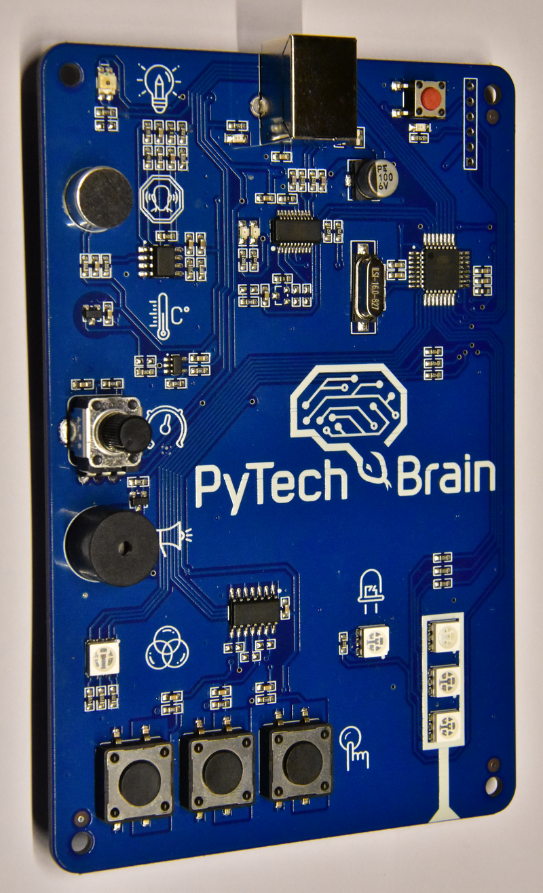

# s2a_PyTechBrain
Scratch 2.0 i PyTechBrain - rozszerzenie dla Scratch'a 2.0 do programowania płytki PyTechBrain lub Arduino UNO.
Opracowanie bazuje na projekcie https://github.com/MrYsLab/s2aio i płytce http://pytechbrain.edu.pl/.
# PyTechBrain

Płytka jest zbudowana na podstawie Arduino i posiada wgrany szkic (oprogramowanie) <i>FirmataPlus.ino</i> autorstwa Alana Yorinks'a (https://github.com/MrYsLab/pymata-aio/wiki/Uploading-FirmataPlus-to-Arduino).
